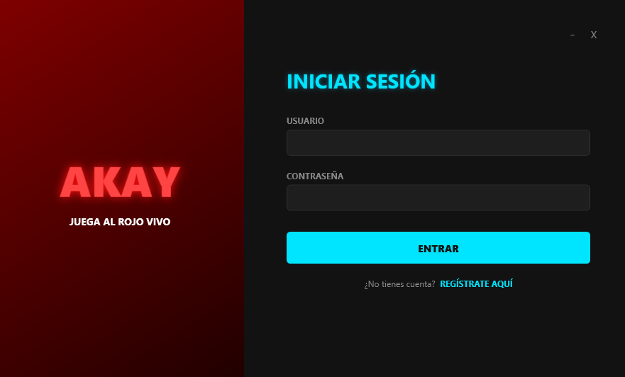
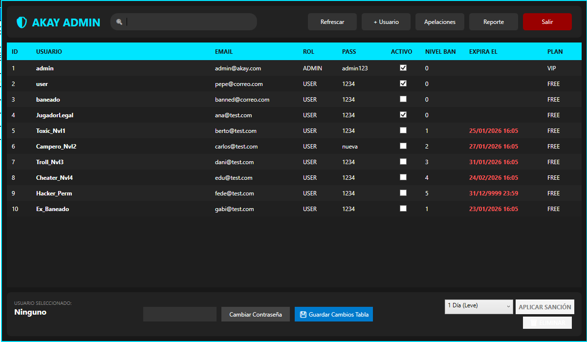
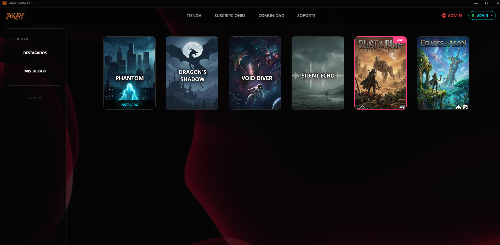
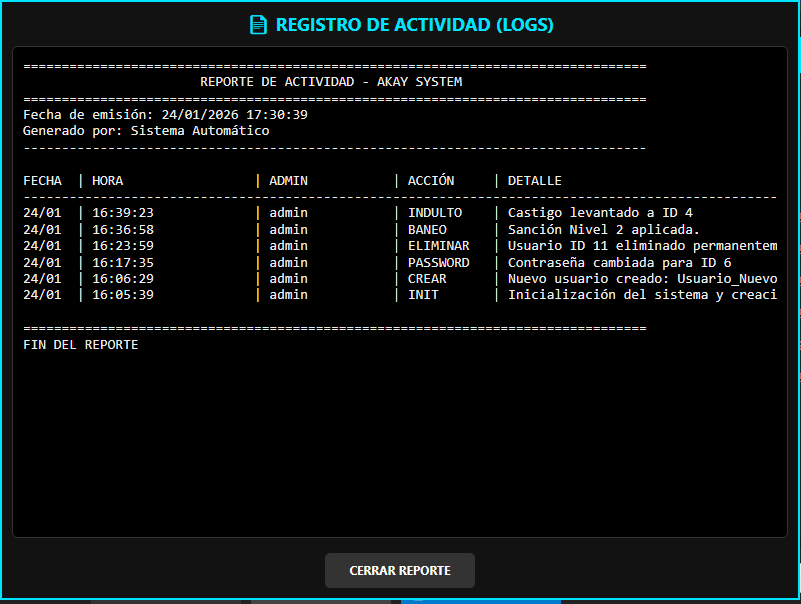

# 🛡️ AKAY SYSTEM - Admin & Launcher


**AKAY SYSTEM** es una aplicación de escritorio moderna desarrollada en **C# y WPF** que simula una plataforma de gestión de videojuegos y administración de usuarios.

El proyecto destaca por su **Interfaz "Dark Gamer"**, eliminando los bordes estándar de Windows para ofrecer una experiencia inmersiva con ventanas personalizadas, efectos de neón y un sistema robusto de gestión de datos.

---

## ✨ Características Principales

### 🎨 Diseño y Experiencia de Usuario (UX)
* **Ventana Personalizada:** Sin bordes de sistema (WindowStyle None), con controles de ventana hechos a medida.
* **Alertas Propias:** Se ha eliminado el `MessageBox` nativo de Windows. Ahora el sistema usa **ventanas de diálogo personalizadas** (`CustomMessageBox`) con estética oscura y colores semánticos (Rojo para eliminar, Verde para éxito, Cian para info).
* **Dimmer Overlay:** Sistema de "velo negro" que oscurece el fondo al abrir ventanas modales.
* **Estética Gamer:** Paleta de colores Neón (Cian/Rojo) sobre fondos oscuros `#181818`.

### 🛡️ Sistema de Administración y Bans (Core)
* **Grados de Sanción:** Sistema escalonado de 5 niveles con cálculo automático de fechas:
    1. 1 Día
    2. 3 Días
    3. 1 Semana
    4. 1 Mes
    5. Permanente
* **Auto-Desbaneo (Lazy Update):** Al iniciar sesión, el sistema verifica matemáticamente si la sanción ha expirado y libera al usuario automáticamente.
* **Panel de Admin Avanzado:**
    * Buscador en tiempo real.
    * Visualización de fecha exacta de fin de baneo.
    * Edición rápida de roles y contraseñas.

### 📊 Reportes y Logs
* **Auditoría Completa:** Cada acción importante (banear, crear usuario, borrar) queda registrada en la base de datos `log_actividad`.
* **Visor de Reportes:** Ventana integrada estilo "Terminal" que genera un informe detallado de la actividad de los administradores.
* **Sistema de Apelaciones:** Buzón donde los usuarios baneados pueden solicitar el desbloqueo.

---

## 📷 Capturas de Pantalla

| Login Screen | Panel de Admin |
|:---:|:---:|
|  |  |

| Home Gamer | Visor de Reportes |
|:---:|:---:|
|  |  |


---

## 🛠️ Tecnologías

* **Lenguaje:** C# (.NET Framework / Core)
* **Interfaz:** WPF (Windows Presentation Foundation)
* **Base de Datos:** MySQL
* **Librería:** `MySql.Data`
* **IDE:** Visual Studio 2022

---

## ⚙️ Instalación y Configuración

### 1. Clonar el Repositorio
```bash
git clone [https://github.com/TU_USUARIO/PracticaLogin.git](https://github.com/TU_USUARIO/PracticaLogin.git)
```

### 2. Configurar la Base de Datos
Este proyecto requiere una base de datos MySQL. Haz clic abajo para ver el script:

<details>
<summary><strong>🔻 CLICK AQUÍ PARA VER EL SCRIPT SQL</strong></summary>

```sql
-- ==========================================================
-- 1. PREPARACIÓN DEL ENTORNO
-- ==========================================================
-- Elimina la base de datos si ya existe para empezar de cero
DROP DATABASE IF EXISTS akay_data;
-- Crea la base de datos
CREATE DATABASE akay_data;
-- Selecciona la base de datos para trabajar en ella
USE akay_data;

-- ==========================================================
-- 2. DEFINICIÓN DE ESTRUCTURAS (TABLAS)
-- ==========================================================

-- Tabla que almacena la información de los usuarios y administradores
CREATE TABLE usuarios (
    id INT AUTO_INCREMENT PRIMARY KEY,
    nombre VARCHAR(100),
    apellidos VARCHAR(100),
    username VARCHAR(50) UNIQUE,
    password VARCHAR(255),
    email VARCHAR(100),
    telefono VARCHAR(20),
    cp VARCHAR(10),
    rol VARCHAR(20) DEFAULT 'USER',
    activo TINYINT(1) DEFAULT 1,
    grado_baneo INT DEFAULT 0,
    fin_baneo DATETIME NULL,
    suscripcion VARCHAR(20) DEFAULT 'FREE'
);

-- Tabla para el catálogo de juegos disponibles
CREATE TABLE videojuegos (
    id INT AUTO_INCREMENT PRIMARY KEY,
    titulo VARCHAR(100) NOT NULL,
    tematica VARCHAR(50),       -- Género
    coste DECIMAL(10, 2),       -- Precio
    espacio_gb DECIMAL(10, 2),  -- Tamaño GB
    online TINYINT(1),          -- 1 para Online, 0 para Local
    jugadores INT,              -- Cantidad de jugadores
    imagen_url VARCHAR(255)     -- Ruta de la foto
);

-- Tabla que relaciona qué usuarios han comprado qué juegos
CREATE TABLE biblioteca (
    id INT AUTO_INCREMENT PRIMARY KEY,
    id_usuario INT NOT NULL,
    id_videojuego INT NOT NULL,
    fecha_compra DATETIME DEFAULT CURRENT_TIMESTAMP,
    FOREIGN KEY (id_usuario) REFERENCES usuarios(id) ON DELETE CASCADE,
    FOREIGN KEY (id_videojuego) REFERENCES videojuegos(id) ON DELETE CASCADE
);

-- Tabla de auditoría para registrar las acciones de los administradores
CREATE TABLE log_actividad (
    id_log INT AUTO_INCREMENT PRIMARY KEY,
    id_admin INT NOT NULL,
    accion VARCHAR(50),
    descripcion TEXT,
    fecha_hora DATETIME DEFAULT CURRENT_TIMESTAMP,
    FOREIGN KEY (id_admin) REFERENCES usuarios(id) ON DELETE CASCADE
);

-- Tabla para gestionar las peticiones de desbaneo de los usuarios
CREATE TABLE apelaciones (
    id INT AUTO_INCREMENT PRIMARY KEY,
    id_usuario INT NOT NULL,
    username VARCHAR(50),
    mensaje TEXT,
    fecha DATETIME DEFAULT CURRENT_TIMESTAMP,
    FOREIGN KEY (id_usuario) REFERENCES usuarios(id) ON DELETE CASCADE
);

-- Nueva tabla para la gestión de soporte técnico e incidencias
CREATE TABLE IF NOT EXISTS soporte_tickets (
    id INT AUTO_INCREMENT PRIMARY KEY,
    id_usuario INT NOT NULL,
    motivo VARCHAR(100),
    mensaje TEXT,
    estado VARCHAR(20) DEFAULT 'ABIERTO', -- 'ABIERTO' o 'RESUELTO'
    fecha DATETIME DEFAULT CURRENT_TIMESTAMP,
    FOREIGN KEY (id_usuario) REFERENCES usuarios(id) ON DELETE CASCADE
);

-- ==========================================================
-- 3. CARGA DE DATOS (USUARIOS Y ADMINS ORIGINALES)
-- ==========================================================

-- Admin y Usuarios básicos
INSERT INTO usuarios (username, password, email, rol, activo, suscripcion)
VALUES ('admin', 'admin123', 'admin@akay.com', 'ADMIN', 1, 'VIP');

INSERT INTO usuarios (username, password, email, rol, activo)
VALUES ('user', '1234', 'user@email.com', 'USER', 1);

-- 1. Usuario LIMPIO (Activo)
INSERT INTO usuarios (nombre, apellidos, username, password, email, rol, activo, grado_baneo, fin_baneo)
VALUES ('Ana', 'Limpia', 'JugadorLegal', '1234', 'ana@test.com', 'USER', 1, 0, NULL);

-- 2. Usuario BANEADO GRADO 1 (1 Día desde hoy)
INSERT INTO usuarios (nombre, apellidos, username, password, email, rol, activo, grado_baneo, fin_baneo)
VALUES ('Berto', 'Leve', 'Toxic_Nvl1', '1234', 'berto@test.com', 'USER', 0, 1, DATE_ADD(NOW(), INTERVAL 1 DAY));

-- 3. Usuario BANEADO GRADO 2 (3 Días desde hoy)
INSERT INTO usuarios (nombre, apellidos, username, password, email, rol, activo, grado_baneo, fin_baneo)
VALUES ('Carlos', 'Medio', 'Campero_Nvl2', '1234', 'carlos@test.com', 'USER', 0, 2, DATE_ADD(NOW(), INTERVAL 3 DAY));

-- 4. Usuario BANEADO GRADO 3 (1 Semana desde hoy)
INSERT INTO usuarios (nombre, apellidos, username, password, email, rol, activo, grado_baneo, fin_baneo)
VALUES ('Daniela', 'Grave', 'Troll_Nvl3', '1234', 'dani@test.com', 'USER', 0, 3, DATE_ADD(NOW(), INTERVAL 7 DAY));

-- 5. Usuario BANEADO GRADO 4 (1 Mes desde hoy)
INSERT INTO usuarios (nombre, apellidos, username, password, email, rol, activo, grado_baneo, fin_baneo)
VALUES ('Edu', 'Muy Grave', 'Cheater_Nvl4', '1234', 'edu@test.com', 'USER', 0, 4, DATE_ADD(NOW(), INTERVAL 1 MONTH));

-- 6. Usuario BANEADO GRADO 5 (PERMANENTE - Año 9999)
INSERT INTO usuarios (nombre, apellidos, username, password, email, rol, activo, grado_baneo, fin_baneo)
VALUES ('Fede', 'Hacker', 'Hacker_Perm', '1234', 'fede@test.com', 'USER', 0, 5, '9999-12-31 23:59:59');

-- 7. Usuario CON BANEO EXPIRADO
INSERT INTO usuarios (nombre, apellidos, username, password, email, rol, activo, grado_baneo, fin_baneo)
VALUES ('Gabi', 'Perdonado', 'Ex_Baneado', '1234', 'gabi@test.com', 'USER', 0, 1, DATE_SUB(NOW(), INTERVAL 1 DAY));

-- Cambio de longitud de columna y creación de admins específicos
ALTER TABLE usuarios MODIFY COLUMN rol VARCHAR(20);

INSERT INTO usuarios (username, password, email, rol, activo) VALUES ('SuperAdmin', '1234', 'super@akay.com', 'SUPERADMIN', 1);
INSERT INTO usuarios (username, password, email, rol, activo) VALUES ('adminJ', '1234', 'games@akay.com', 'GAME_ADMIN', 1);
INSERT INTO usuarios (username, password, email, rol, activo) VALUES ('adminS', '1234', 'support@akay.com', 'SUPPORT_ADMIN', 1);
INSERT INTO usuarios (username, password, email, rol, activo) VALUES ('adminU', '1234', 'mod@akay.com', 'USER_ADMIN', 1);

-- Ticket de prueba para soporte
INSERT INTO soporte_tickets (id_usuario, motivo, mensaje) 
VALUES (2, 'Error de conexión', 'No puedo entrar al servidor de GTA V desde ayer.');

-- ==========================================================
-- 4. CARGA DE CATÁLOGO (VIDEOJUEGOS ORIGINALES)
-- ==========================================================

SET SQL_SAFE_UPDATES = 0;

-- Limpieza para re-estructuración
DROP TABLE IF EXISTS biblioteca;
DROP TABLE IF EXISTS videojuegos; 

-- Re-creación con soporte para banners
CREATE TABLE videojuegos (
    id INT AUTO_INCREMENT PRIMARY KEY,
    titulo VARCHAR(100),
    tematica VARCHAR(50),
    coste DECIMAL(10, 2),
    espacio_gb DECIMAL(10, 2),
    online TINYINT,
    jugadores INT,
    imagen_url VARCHAR(500),       -- FOTO VERTICAL (PORTADA)
    imagen_fondo_url VARCHAR(500)  -- FOTO HORIZONTAL (BANNER)
);

-- Re-creación de biblioteca
CREATE TABLE biblioteca (
    id INT AUTO_INCREMENT PRIMARY KEY,
    id_usuario INT,
    id_videojuego INT,
    fecha_compra DATETIME DEFAULT NOW()
);

-- Inserción de tu catálogo completo
INSERT INTO videojuegos (titulo, tematica, coste, espacio_gb, online, jugadores, imagen_url, imagen_fondo_url) VALUES 
('Grand Theft Auto V', 'Acción', 29.99, 110.0, 1, 30, 
 'https://m.media-amazon.com/images/I/51MFu2e82VL._AC_UF894,1000_QL80_.jpg', 
 'https://wallpapers.com/images/featured-full/imagenes-de-grand-theft-auto-v-naej4yiap4gnxh2o.jpg'),

('EA FC 24', 'Deportes', 69.99, 50.0, 1, 4, 
 'https://e00-marca.uecdn.es/assets/multimedia/imagenes/2023/07/10/16890010411401.jpg', 
 'https://assetsio.gnwcdn.com/eafc.png?width=690&quality=85&format=jpg&auto=webp'),

('Fortnite', 'Battle Royale', 0.00, 35.0, 1, 100, 
 'https://i.pinimg.com/736x/8f/16/e9/8f16e97ab5cc7873debc229c7a527a07.jpg', 
 'https://www.cecarm.com/servlet/integra.servlets.Imagenes?METHOD=VERIMAGEN_164316&nombre=fortnite-portada-pc.jpg'),

('Minecraft', 'Aventura', 19.95, 1.5, 1, 10, 
 'https://i.pinimg.com/originals/8d/85/4f/8d854f2f5e92e8c9d6ce7c8d7b4ea06c.jpg', 
 'https://phantom.estaticos-marca.com/d42b346684acc981057cbb783008d869/resize/660/f/webp/assets/multimedia/imagenes/2024/04/03/17121424603596.jpg'),

('Call of Duty: MW3', 'Shooter', 79.99, 150.0, 1, 12, 
 'https://i.3djuegos.com/juegos/19077/call_of_duty_modern_warfare_3__2023_/fotos/ficha/call_of_duty_modern_warfare_3__2023_-5829139.jpg', 
 'https://s2.abcstatics.com/abc/www/multimedia/tecnologia/2023/11/15/mw3-RJo0CaIbI8dC1T6AZlCPb6H-1200x840@abc.jpg'),

('God of War', 'Acción', 49.99, 70.0, 0, 1, 
 'https://m.media-amazon.com/images/I/61LJWSvJGEL._AC_UF894,1000_QL80_.jpg', 
 'https://media.rawg.io/media/games/4be/4be6a6ad0364751a96229c56bf69be59.jpg'),

('League of Legends', 'MOBA', 0.00, 20.0, 1, 10, 
 'https://cdn1.epicgames.com/offer/24b9b5e323bc40eea252a10cdd3b2f10/EGS_LeagueofLegends_RiotGames_S2_1200x1600-112729f9da450fe377e11d40029c4831', 
 'https://phantom.estaticos-marca.com/ad7e44d8a02d5ea8de4a01a87cc5c387/crop/0x0/1980x1112/resize/660/f/webp/assets/multimedia/imagenes/2022/03/16/16474267987028.jpg'),

('The Witcher 3', 'RPG', 29.99, 60.0, 0, 1, 
 'https://i.3djuegos.com/juegos/9592/the_witcher_3/fotos/ficha/the_witcher_3-2546814.webp', 
  'https://media.rawg.io/media/games/618/618c2031a07bbff6b4f611f10b6bcdbc.jpg'),

('Cyberpunk 2077', 'RPG', 59.99, 75.0, 0, 1, 
 'https://wallpapers.com/images/featured/cyberpunk-2077-q0o5txv6a3pqp7a9.jpg', 
 'https://media.rawg.io/media/games/26d/26d4437715bee60138dab4a7c8c59c92.jpg'),

('Elden Ring', 'RPG', 59.99, 60.0, 1, 4, 
 'https://upload.wikimedia.org/wikipedia/en/b/b9/Elden_Ring_Box_art.jpg', 
 'https://wallpapers.com/images/featured/elden-ring-6r85th0gnhifsqd0.jpg');

SET SQL_SAFE_UPDATES = 1;
```
</details>


### 3. Conexión
Abre el archivo DatabaseHelper.cs y asegúrate de que la cadena de conexión coincida con tu MySQL local:

```

private static string connectionString = "Server=localhost;Database=akay_data;Uid=root;Pwd=TU_CONTRASEÑA;";

```
## 👤 Credenciales Demo

| Rol | Usuario | Contraseña |
| :--- | :--- | :--- |
| **Admin** | `admin` | `admin123` |
| **User** | `user` | `1234` |
| **Baneado** | `baneado` | `1234` |


## 📄 Licencia
Este proyecto es una práctica académica y se distribuye bajo la licencia MIT.
